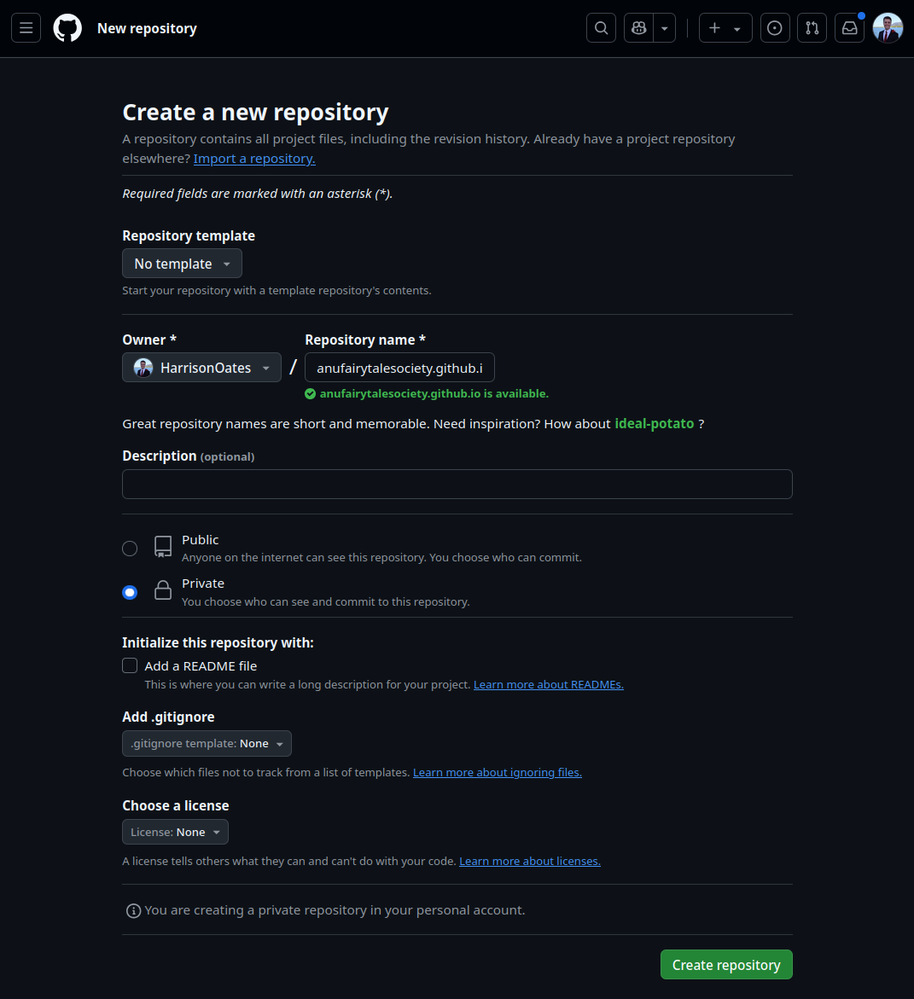

# Building and Hosting Websites for ANU Student Clubs and Societies
This repository is a guide for ANU student clubs and societies to build and host their websites. The guide is written in a way that is accessible to beginners, and assumes no prior knowledge of web development. The guide is open source and contributions are welcome. It is intended to be a living document that is updated as new technologies and best practices emerge.

- Github Pages Documentation: https://docs.github.com/en/pages


## Table of Contents
1. [Why a Website?](#why-a-website)
3. [Setting Up a GitHub Repository](#setting-up-a-github-repository)
4. [The Website](#the-website)
    + [Migrating an Existing Website to GitHub](#migrating-an-existing-website-to-github)
    + [Creating a New Website](#creating-a-new-website)

## Why a Website?
s.37 of the Clubs Regulations beings with the following:

> Within 2 weeks of holding a general meeting, the club must post the following documentation to [a] publicly available website: [...]

This is an affiliation requirement for ANU student clubs and societies. While website builders are available, they often come with costs for hosting and custom domains. This guide will show you how to build a new website, or migrate an existing website, for free using GitHub Pages. Ongoing costs will be limited to the cost of a custom domain, if desired. 

## Setting Up a GitHub Repository

> A repository is a place where you can store code and other files. It is like a folder on your computer, but it is stored on GitHub's servers. The repository will be used to store the files that make up your website.

First, you will need a GitHub account. If you don't have one, you can sign up [here](github.com). This should be done with an email address that is associated with the club or society. Once you have an account, you can create a new repository by clicking the green "New" button in the top right corner of the side menu.


You will be taken to a page where you can name your repository and provide a description. The repository name should be in the format `clubname.github.io`, where `clubname` is the name of your club or society. This is a special format that GitHub recognises as a website.

Set the repository to private. This will prevent the repository (not the website) from being indexed by search engines. You can change this setting later if you wish.

You should also make sure to initialise the repository with a README. This will create a `README.md` file in the repository that will be displayed on the repository's homepage. You can also add a `.gitignore` file and a license if you wish, but these are not necessary for the website.



Once you have filled out the form, click the green "Create repository" button. You will be taken to the repository's homepage. You can now add files to the repository.

## The Website
There are two ways to create a website for your club or society: you can either migrate an existing website to GitHub, or create a new website from scratch. The following sections will guide you through both processes.

- Go to [Migrating an Existing Website to GitHub](#migrating-an-existing-website-to-github) if you already have a website that you would like to move to GitHub. This includes if you have a website on a website builder like Wix or Squarespace.

- Go to [Creating a New Website](#creating-a-new-website) if you would like to create and host a new website from scratch. 

## Migrating an Existing Website to GitHub

### Site-builder specific instructions
- Weebly: **Settings (Top menu) > General (Left side menu) > Archive**, enter your email address and click on **"Email Archive"**. After some time, you should receive an email with a link where you can download a zip file with all the static contents of your website, which you can then host anywhere. (Source: [Reddit](https://www.reddit.com/r/Weebly/comments/rh9otp/possible_to_export_a_static_weebly_site_to_html/))

### General instructions
If instructions for your site-builder are not available above, or they do not work, we can use a tool called `wget` to download the contents of your old website. `wget` is a command-line tool that can download files from the internet. 
You should only have to do this once, and then you can update the website by pushing changes to the GitHub repository.

#### Installing `wget`
- **Windows**: Download the latest x64 executable from [here](https://eternallybored.org/misc/wget/). Install as you would any other program.
- **Mac**: We'll download using [Homebrew](https://brew.sh/), a package manager for macOS. Homebrew can be installed from a [`.pkg`  file hosted on their Github](https://github.com/Homebrew/brew/releases/tag/4.4.14).
Then, open Terminal and run the following: `brew install wget`.
- **Linux**: `wget` is installed by default.

#### Downloading the website using `wget`
Open Powershell / Terminal and run the following command, replacing `https://www.club-old-website.com/` with the URL of your old website:

```bash
wget -E -r -k -l 10 -p https://www.club-old-website.com/
```
This command will download the website and all its assets (images, CSS, etc.) to your computer. The website will be saved in a folder called `www.club-old-website.com`. You can now move these files to your GitHub repository.

Hit `upload files` on the Github repository page and drag and drop the files inside `www.club-old-website.com` into the repository. You'll need to add a commit message to describe the changes you've made. You can also commit the files using Git if you are familiar with it. Hit `commit changes' to save the files to the repository.

## Creating a New Website
To come.

